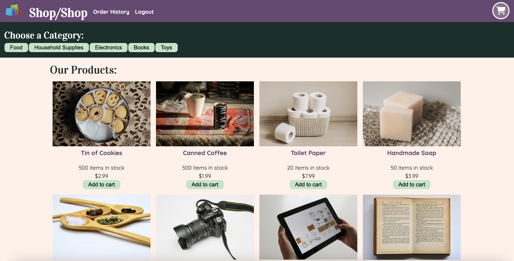

# Shop/Shop Site

## Description

The Redux Store is a web application that modifies an e-commerce platform to use Redux for state management in a large-scale React application. This will bring industry-standard state management capabilities to the app, improving its efficiency and scalability.

  ## Table of Contents
  * [Technology Stack](#technology-stack)
  * [User Story](#user-story)
  * [Acceptance Criteria](#acceptance-criteria)
  * [Installation](#installation)
  * [Tests](#tests)
  * [Heroku Deployment](#heroku-deployment)
  * [Screenshot](#screenshot)
  * [License](#license)
  * [Questions](#questions)


## Technology Stack


## User Story

```md
AS a senior engineer working on an e-commerce platform
I WANT my platform to use Redux to manage global state instead of the Context API
SO THAT my website's state management is taken out of the React ecosystem
```

## Acceptance Criteria

```md
GIVEN an e-commerce platform that uses Redux to manage global  
state
WHEN I review the app’s store
THEN I find that the app uses a Redux store instead of the  
Context API
WHEN I review the way the React front end accesses the store
THEN I find that the app uses a Redux provider
WHEN I review the way the app determines changes to its global  
state
THEN I find that the app passes reducers to a Redux store  
instead of using the Context API
WHEN I review the way the app extracts state data from the store
THEN I find that the app uses Redux instead of the Context API
WHEN I review the way the app dispatches actions
THEN I find that the app uses Redux instead of the Context API
```

## Installation
  * Ensure you are running Node.js v16.  
  * Clone the repository.
  ```
    git clone git@github.com:erin-m-keller/keller-redux.git
  ```
  * Install the dependencies.
  ```bash
    npm i 
  ```
  * Seed the application.
  ```bash
    npm run seed
  ```
  * Start the application.
  ```md
    npm run develop
  ```
  > Application is available at: http://localhost:3000/  
  > GraphQL is available at: http://localhost:3001/graphql  

  * To test Stripe payment, use the following false CC numbers.
  - 4242 4242 4242 4242	Visa - CVC: Any 3 digits, EXP: Future date
  - 4000 0566 5566 5556	Visa - CVC: Any 3 digits, EXP: Future date
  - 5105 1051 0510 5100	MasterCard - CVC: Any 3 digits, EXP: Future date
  - 6200 0000 0000 0005	UnionPay - CVC: Any 3 digits, EXP: Future date

## Heroku Deployment

[Shop/Shop Site](https://keller-redux-6960698a5b38.herokuapp.com/)

## Screenshot



## License

[](https://lbesson.mit-license.org/)

## Questions

If you have any questions about this project, please contact me directly at [aestheticartist@gmail.com](aestheticartist@gmail.com).  
You can view more of my projects [here](https://github.com/erin-m-keller).